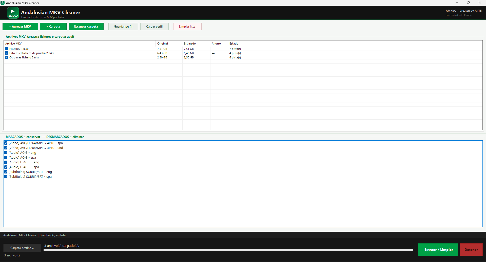

# 🎬 Andalusian MKV Cleaner

**Batch MKV track cleaner — Remove unwanted audio, subtitle and video tracks from MKV files in bulk.**


---

### 🌍 Language / Idioma
My native language is **Spanish** 🇪🇸. The English content in this repository is translated. I appreciate your patience and welcome any corrections via Issues or Pull Requests!

Mi idioma materno es el **español** 🇪🇸. El contenido en inglés de este repositorio es traducido. ¡Agradezco tu paciencia y acepto cualquier corrección mediante Issues o Pull Requests!

---

## 📋 Description

Andalusian MKV Cleaner is a free Windows application that lets you clean up MKV files by removing unwanted tracks (audio, subtitles, video) from multiple files at once. It uses **mkvmerge** (part of MKVToolNix) as its processing engine.

Perfect for:
- Removing unwanted language audio tracks
- Stripping unnecessary subtitle tracks
- Cleaning up downloaded movies and series in bulk
- Reducing file size by removing unused tracks

---

## ✨ Features

- ✅ **Batch processing** — add files or entire folders at once
- ✅ **Visual track selector** — clearly see and choose which tracks to keep or remove
- ✅ **Size estimation** — estimates the output file size before processing
- ✅ **Real-time progress** — shows processing percentage per file
- ✅ **Parallel scanning** — scans multiple files simultaneously for speed
- ✅ **Profile save/load** — save your track selection preferences for reuse
- ✅ **Custom output folder** — choose where to save the cleaned files
- ✅ **Duplicate detection** — warns if output files already exist
- ✅ **Drag & drop** — drag files or folders directly into the app

---

## 📸 Screenshot



---

## ⚠️ Instalación y Seguridad / Installation & Safety

### Castellano
Es posible que al ejecutar **AndalusianMKVCleaner.exe**, Windows muestre un aviso de **SmartScreen** ("Windows protegió su PC"). 

**¿Por qué aparece esto?**
Este mensaje aparece porque el ejecutable no tiene una firma digital de pago (Certificado de Desarrollador). Al ser un proyecto de código abierto e independiente, Microsoft aún no reconoce la "reputación" del archivo. **El programa es totalmente seguro.**

**Cómo ejecutarlo:**
1. Haz clic en **"Más información"** (More info).
2. Pulsa el botón **"Ejecutar de todos modos"** (Run anyway).

---

### English
When running **AndalusianMKVCleaner.exe**, you might see a **Windows SmartScreen** warning ("Windows protected your PC").

**Why is this happening?**
This occurs because the executable is not signed with a paid Developer Certificate. As this is an independent open-source project, Microsoft hasn't established a "reputation" for the file yet. **The software is completely safe to use.**

**How to proceed:**
1. Click on **"More info"**.
2. Click the **"Run anyway"** button.

---

## 🔧 Requirements

- Windows 10 or later (x64)
- [MKVToolNix](https://mkvtoolnix.download/) installed (provides `mkvmerge.exe`)
- .NET 8.0 Runtime ([download here](https://dotnet.microsoft.com/download/dotnet/8.0))

---

## 🚀 Installation

1. Download the latest release from the [Releases](../../releases) page
2. Install [MKVToolNix](https://mkvtoolnix.download/) if you haven't already
3. Run `AndalusianMKVCleaner.exe`

No installation required — it's a portable executable.

---

## 📖 How to use

1. **Add files** — click `+ Add MKV`, `+ Folder`, or drag and drop files/folders
2. **Select files** — check the files you want to process in the file list
3. **Select tracks** — in the bottom panel, uncheck the tracks you want to remove
4. **Set destination** (optional) — click `Set destination` to choose an output folder
5. **Click Extract** — the app will process all checked files keeping only the selected tracks

> ℹ️ **Checked = keep**, **Unchecked = remove**

---

## ⚙️ How it works

The app calls `mkvmerge` behind the scenes to remux the MKV files, keeping only the tracks you selected. This is a **lossless** process — no re-encoding is done, so there is no quality loss and processing is fast.

Output files are saved as `originalname_clean.mkv`.

---

## 🔍 Track types

| Prefix | Type |
|--------|------|
| `[Video]` | Video tracks |
| `[Audio]` | Audio tracks |
| `[Subtitulos]` | Subtitle tracks |

---

## 📦 Building from source

Requirements:
- Visual Studio 2022 or later
- .NET 8.0 SDK

```bash
git clone https://github.com/YOUR_USERNAME/Andalusian-MKV-Cleaner.git
cd Andalusian-MKV-Cleaner
dotnet build
```

---

## 📄 License

This project is licensed under the MIT License — see the [LICENSE](LICENSE) file for details.

---

## 🙏 Acknowledgements

- [MKVToolNix](https://mkvtoolnix.download/) by Moritz Bunkus — the engine that powers this app

---

## 📬 Contributing

Bug reports and suggestions are welcome! Please open an [issue](../../issues) on GitHub.
